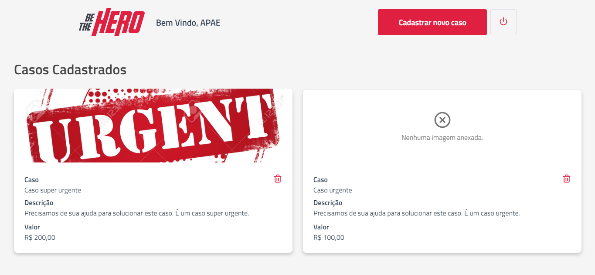
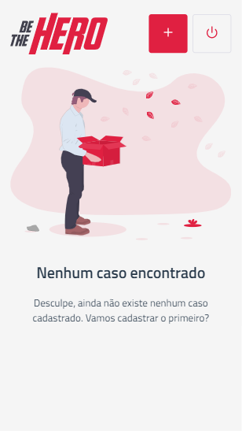
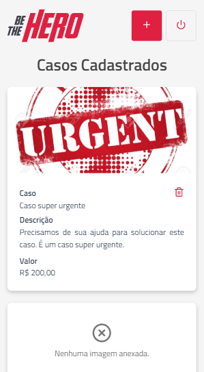

  

# Be The Hero

Aplicação construída com o intuito de conectar ONGs a pessoas que tem disponibilidade em ajudar.

Este projeto foi desenvolvido com a finalidade de aprofundar meus conhecimentos em VueJS. É uma reprodução do frontend da aplicação desenvolvida durante a 11ª edição da Semana Omnistack, promovida pela Rocketseat, construída utilizando a VueJS.

**Aplicação disponível em:** https://betheherovue.netlify.app/

#### Melhorias em relação ao [projeto original](https://github.com/ederwms/bethehero):
- Site responsivo
- Autenticação com JWT
- Renovação automática de token com Axios Interceptors
- Upload opcional de imagens no cadastro de casos.
- Novo backend (NodeJS + MySQL): [Ir para repositório](https://github.com/ederwms/api-bethehero)

<!--
#### Features em progresso:
- Área para que o usuário entre em contato com a ONGs para ajudar. (implementada, no projeto original, somente no mobile)
-->

### Screenshots

#### Tela de login

#### Tela de cadastro

#### Listagem de casos (nenhum cadastrado)

#### Listagem de casos

#### Cadastro de novo caso

### Mobile

  

  
  
  

  
  
  

**&copy;** [Rocketseat](https://rocketseat.com.br/)

### Licença
[MIT](https://github.com/ederwms/bethehero-vue/blob/master/LICENSE)

Desenvolvido por [Éder Sousa](https://github.com/ederwms)
